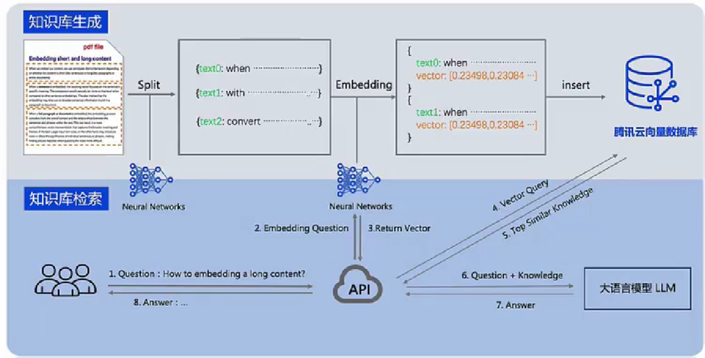

# 大模型系列-数据处理之向量数据库


大模型业务流程


```text
思考：
向量数据库Vector-DB对大模型的价值和意义是什么？
向量数据库Vector-DB会不会随看大模型能力的提升而被代替？
围绕着大模型配套软件开发工具，向量数据库处于什么样的角色定位？
```


## 背景

>  互联网非结构化数据以惊人速度增长，比如文档、图像、视频和普通文本等形式。 传统数据库针对结构化数据建立，处理非结构化数据变得越来越困难。

> 仅通过关键词分析、 数据分类不足以完全表示挖掘和学习复杂数据所蕴含知识，特别在AI一切皆`Embedding Vector`时代。


```text
AI与Vector的关系：
移动互联网JSON支撑大规模灵活数据存储的通用格式，推动MongoDB流行。
AI时代向量Vector作为神经网络基本数据结构，Vector也是大模型理解世界数据形式。
```


神经网络的基本组成

基于数据流图（DAG）的计算框架。

```text
基本数据结构：Tensor张量
Tensor形状：[2, 3, 45]
元素类型：int, float, string, ...

基本运算单元：Operator算子
由最基本的代数算子组成
根据深度学习结构组成复杂算子
N个输入Tensor，M个输出Tensor
```

参考：

https://github.com/chenzomi12/AISystem/blob/main/05Framework/03DataFlow/02Computegraph.md

https://github.com/chenzomi12/AISystem

https://github.com/chenzomi12/AISystem/blob/main/images/knowledge_list.png


`向量检索的核心在于相似性搜索（Similarity Search），在深入了解相似性搜索前，需要详细了解特征Feature和向量Vector的概念和原理`


## 向量与检索

### 向量Vector

什么是向量Vector?

> AI神经网络模型设计，在神经元激活后形成对输入数据表征，即人脑理解和学习的方式。
> AI模型实际识别和理解非具体文字符号，而是神经网络对各类数据向量化Vector表示。

```
向量是什么？
向量是多维数学空间中的一个坐标点。

向量从哪来？
向量来源于对世界数字化的抽象。

向量怎么用？
向量用来搜索真实世界不同模态数据。
```


向量类型（Vector type）

| 向量类型 | 详细介绍                                                     |
| -------- | ------------------------------------------------------------ |
| 图像向量 | 通过神经网络模型提取图像特征向量Feature Map，特征向量Feature Map提取输入图像的高维信息，如颜色、形状、纹理等，最终可以用于图像识别、检索等任务。 |
| 文本向量 | 通过词嵌入Work Embedding技术如`Word2vec`、`BERT`等生成文本特征向量，文本特征向量包含文本语义高维信息，可以用于文本分类、 情感分析等`NLP`任务。 |
| 语音向量 | 通过声学模型`Acoustic Model`从音频信号中提取的音频的频谱特征向量，频谱特征向量提取声音的高维特性，如音调、节奏、音色等，可用于语音识别、 声纹识别等任务。 |


### Embedding

什么是Embedding？

```
Embedding过程：
非结构化数据转换成向量的过程。

Embedding作用：
通过深度学习的训练，将真实世界离散数据，投影到高维数据空间上，通过数据在空间中间的距离体现真实世界的相似度。
```


### Vector Embedding

```
1、Vector Embedding：向量嵌入
将非数值词语/符号等非结构化数据，编码成数值向量。

2、Word Embedding：词嵌入
通过NN来学习，文本中词语作为NN网络输入，输出对应词向量Word Vector。
词向量是一个数值向量，每个数值代表词语的某个特征。
```


举个例子：

如何区分猫的种类？

人类通过不同事物间不同特征来识别种类，比如分辨不同种类小猫，可以通过体型大小、毛发长度、鼻子长短、 脸型等特征区分。
比如不同种类猫的体型大小，映射到一维度坐标轴上，就会得到一个体型特征与一维坐标的数值。


单靠体型特征并不能充分区分不同种类的猫咪，比如金渐层、银渐层的体型接近，难以通过体型直接区分。因此会增加其它特征，例如毛发颜色。


只要特征维度足够多，就能将所有猫区分开来，最后得到一个高维坐标系。

虽然难以想象高维坐标系，但是在向量数组中，只需要向数组中追加数值即可。


重点

`向量维度不是越高越好。维度越高，特征展开就越散，向量维度越低，嵌入空间Embedding Space中特征表示就越紧凑，应该有个合理的区间值。维度大小会影响下游任务或模型训练质量。`


https://chenzomi12.github.io/


总结

```
向量是AI理解世界的通用数据形式：
无论游戏、网络、教育、医疗等，各行业领域中使用AI能力和场景越来越多。
AI框架基本组成为向量+算子，训练和推理时可以看做向量搜索/索引和向量计算过程。

因此可认为：
向量是AI理解世界的通用数据形式，未来向量将会成为AI的灵魂。
```


## 向量数据库

将向量存到数据库，便于后续语义搜索。


整体架构


```
存储和数据索引
Embedding：数据输入Embedding Model转换为Vector，通过API网关输入到Vector-DB的存储层
Indexing：对向量Vector数据进行分区/分片以实现可扩展性和快速查找
Searching：查询引擎与存储层紧密集成，通过Vector-DB的索引算法快速检索相似量Vector

应用层
Query：用户通过APP UI将查询给Embedding Model，将输入查询转换为与数据相同的Embedding Space
Return：Vector化查询通过API网关发送到查询引擎，可异步处理多个查询，TOP-K结果返回用户
```

DB-Engines Ranking of Vector DBMS


### 与传统数据库区别

```
与传统数据库区别：
传统数据库：
1、关系型数据库
2、非关系型NoSQL数据库
3、分析型数据库

搜索方式：
索引（B-Tree、 倒排等）
排序算法（BM25、 TF-IDF）实现

搜索本质：
基于文本的精确匹配，SQL语言进行精确匹配与查找，输出符合查询条件数据

适合场景：
关键字搜索功能较优，对于语义搜索功能较差
```

```
问题：
传统数据库无法识别语义关系，需要打上标签进行关联，才能实现语义搜索
```

```
差异1：检索方式不同
传统数据库：归结为点查和范围查（精确查找），查询得到结果为符合条件/不符合条件
向量数据库：针对向量近似查找，查询得到结果是与输入条件相似 TOP-K向量

差异2：查询方式不同
传统数据库：直接处理数据，即使用SQL语言对文本精确匹配与查找，输出符合查询条件数据
向量数据库：将非结构化数据转化为向量，再基于向量数据库中进行存储、计算和建立索引
```

```
Pinecone：
https://colab.research.google.com/github/pinecone-io/examples/blob/master/docs/semantic-search.ipynb#scrollTo=JWcO7jAK-N_I

MySQL：
https://dey.mysql.com/doc/connector-python/en/connector-python-example-cursor-select.html
```


`semantic-search.ipynb`


### 向量数据库原理、功能、 特点

随着互联网发展，非结构化数据越来越常见。 为了让计算机理解和处理非结构化的数据，Embedding将各式数据转换为Vector数据。

通过向量数据库存储和索引Vector数据，分析Vector间相关性。


用户输入查询（NLP、 Image、 Audio）被转换成Vector，与源数据本身位于相同 Embedding空间中，Vector通过向量数据进行语义近似搜索，返回与输入查询最相似TOP-K个结果。


**Vector DB定义**

`向量数据库为向量数据提供专用的存储和索引机制。`
向量数据被存储为高维空间中的点，DB为点建立索引（KD-Tree、 BB-Tree、 HNSW等）。

索引结构使得Vector DB高效地进行向量间相似度查询，从而提升处理向量数据效率。


**Vector DB发展**

```
第一阶段（初级）
主要是以文件形式存储向量数据，缺之有效索引和查询能力，典型产品如Lucene等。

第二阶段（发展阶段）
使用KD树等索引结构，可实现一定的查询性能，但在高维空间的查询效率还不高，典型产品有FAISS、Annoy等。

第三阶段（成熟阶段）
通过复杂Index算法实现高效向量索引和查询，处理高维向量数据，典型产品有Milvus、 Elasticsearch等。
```


Vector DB存储向量类型

```
1、私域知识 Domain Knowledge
私域知识是指可以把向量数据库作为大模型的外部知识库。不需要去训练模型，比常见的大模型微调地方法成本更低、速度更快也能通过更新数据库保证AI大模型知识的实时更新。

2、本地存储 Local Storage
将向量数据存储在本地。通过向量的相似关系保证隐私信息不会提供给大模型进行训练。

3、长期记忆 Long Time Memory
长期记忆是相比大模型的短期记忆，大模型如ChatGPT其上下文信息有数量限制。Vector DB作为外部数据库，存储单次上传的超大文本、对话内容等信息，为大模型提供理论上没有上限的长期记忆。
```

**Vector DB解决的问题**

```
主要解决2个问题：高效的检索与高效的分析

1、检索：以图搜图场景，比如人脸检索、人脸支付、车牌号码检索、相似商品检索等
2、分析：以图分析行为，比如人脸撞库、人脸对比、场景再现等
```

**作用1：相似性搜索**

允许根据向量距离或相似性对向量数据Vector进行快速准确的相似性搜索和检索。 

这意味着可以使用Vector DB，根据语义或上下文含义查找最相似或相关的数据，而非精确匹配或预定义标准查询数据库的传统方法。


**作用2：提升性能**
针对大量向量数据Vector存储和检索操作进行优化，每次查询通常处理数亿个向量，并且比传统数据库的处理速度快得多。

以下主要介绍向量数据库最核心的几种技术和能力：
1、相似度计算：使用相似性度量等算法过滤和定位相似的向量

2、相似性搜索：提供Vector检索算法，使向量检索速度显著加快并更精确

3、高效存储：以更紧方式存储向量，如压缩和量化向量数据，尽可能在内存中查询数据

4、分布式：跨多台机器对向量数据进行分片和分片检索


**向量数据库常用评价标准**

```
1、准确率 Precision
准确率 = 检索相关的向量/检索出的向量总数

2、召回率 Recall
召回率 = 检索相关的向量/向量数据库中相关的向量总数

3、每秒平均吞吐 QPS
Query Per Second，QPS是每秒查询数，每秒向量数据库能够处理的查询请求次数

4、平均响应延识 Latency
可量数据库的请求平均响应时间
```

**向量数据库总结**

| 功能                       | 描述                                                         |
| -------------------------- | ------------------------------------------------------------ |
| Vector Embedding  向量嵌入 | 数学上，vector embedding是一个浮点数或二进制数的数组，通过对非结构化数据转换为具体的vector（对非结构化数据的特征抽象）。Vector DB提供数据写入/检索自动向量化，对齐传统数据库的使用体验，用户无需关注向量生成过程。 |
| Similar Search 相似性搜索  | 使用Index算法和特殊数据结构对Embedding进行相似性搜索。用户可以快速找到与给定查询最接近的vector，因此适合对图像或文相似性搜索。其中向量相似度搜索是将输入Vector与数据库进行比较，以找到与查询向量最相以的向量过程 |
| High Performance 提升性能  | Vector DB单索引支持 > 亿级向量数据规模，可支持百万级QPS及毫秒级查询延退。另外对高维向量的高效存储，能够在最小存储空间下处理更大量数据。 |
| 可扩展                     | 具备良好的可扩展性，能够轻松处理大规模数据集，支持对Vector数据进行分片，良好支持广泛依赖嵌入的大语言模型和其他AI应用。 |
| 灵活性                     | 能够处理不同数据（非机构化数据）类型，这些信息不遵循预定义的模型或组织方式，包括文本、图像、音频和视频。 |

**向量数据库面临的挑战**

```
1、有效存储：
向量数据多为浮点或者二进制数据，数据压缩率低，存储成本高。（向量维度高，稀疏矩阵）
2、高效存储：
向量数据库计算复杂度高，需要集群&分布式计算能力。
3、索引复杂：
有tree、graph、hash等多种向量索引方式，索引管理和使用成本高。
4、扩展性：
向量数据库的增长对系统的扩展性要求越来越高。
5、低延退：
查询以ms级别响应业务需求。
```

**相似度如何计算？**

```
数据库提供不同度量算法计算向量相似性。

最常用的是NLP度量算法：
1、点积
2、余弦距离
```

**相似性搜索是什么？**

```
用户查询时，相似性搜索提供与输入向量相似TOP-K向量

比如，使用k最近邻（KNN）算法将查询向量与Vector DB中每个向量进行比较。
```

```
问题：
搜索空间扩展到百万/十亿个数据点时，所需比较数量随着数据增加而线性增加，分布式的线性度下降。查询变慢，如何解决？
```

**如何进行索引？**

```
数据通过索引Indexing存储在向量数据库中，索引通过缩小搜索空间来有效地查找相似向量。
但Embedding维度较高，Vector DB会对Vector特征使用索引算法：
1、K-means and/or Faiss
2、Inverted File Index (IVF)
3、Hierarchical Navigable Small World (HNSW) graphs
```


**混合搜索系统**

```
Key Word搜索：当用户知道期望搜索的结果或者与搜索词中的短语完全匹配时，找到明确相关、有用的结果，使用传统数据库，而非向量数据库

向量搜索：当用户不需要明确的搜索目标，而是期望搜索语义相关、特征相关结果。使用向量数据库，而非传统数据库

混合关键字+向量搜索：结合全文关键字和向量搜索的候选结果使用交义编码器模型对结果重新排名。结合传统数据库和向量数据库
```


**检索基本方式**

```
传统数据库（Elasticsearch、 Opensearch、 MongoDB）：
主要使用类BM25关键字索引算法。与逆文档频率（IDF）相关的关键字频率来生成稀疏向量。

向量数据库：
主要对文本进行编码或物体特征化为稠密Dense Vector，使用双编码器模型Bi-Encoder对生成Embedding Vector Pair进行比较以产生余弦相似度得分。
```


**混合搜索系统与交叉编码器**

```
混合搜索：
将关键字搜索（BM25）和Vector搜索（余弦相似度）获得的搜索结果结合，需要交叉编码器

Cross Encoder：
将两个句子同时输入Encoder模型（BERT）。与Bi-Encoder不同，Cross-Encoder不生成Embedding。

重新排名：
允许通过softmax为一对输入分配最大似然概率进行分类，获取结合关键字+矢量搜索的结果。
```


```
思考？
1、不是大模型让向量数据库火起来的嘛，为什么没有大模型相关的场景？
2、向量数据库的应用场景规模感觉比较有限，增量在哪里？
```


```
向量数据库本身并不支持语义近似，只支持位置Position近似。
需要采用Embedding方式来使得位置接近于语义近似。
```


### `Vector-DB`应用场景


## 大模型关系

向量数据库遇到大模型


`LLM`的出现改变了人机交互方式，带来AI技术革命，但仍然存在很多问题：
1、 知识储备能力不足

2、隐私数据安全性

3、推理算力成本高


如何增强LLM知识的同时保护私域数据安全？

**通过外置数据和工具来增强LLM能力**


### **大模型遇到向量检索**

1、LLM应用离不开Prompt Engine，提示工程离不开向量检索。

2、本质语义搜索，从海量数据中找到匹配的内容，拼接提示词。

3、向量数据库对输入数据Embedding后，使用向量化计算为大模型提供高效的数据存储和查询支撑。


**Vector DB提供、记忆能力，大模型提供问题处理和分析能力**

```text
1、向量数据库Embedding后，使用向量化计算为大模型提供高效的数据存储和查询支撑；
2、大模型与Vector DB深度融合应用为通用人工智能（AGI）的实现提供了可靠路径；
3、大模型新一代AI处理器，提供数据处理能力；Vector DB提供Memory存储能力
```

```text
大模型输入知识被压缩为静态模型参数（13B/70B），模型中参数不会随交互对话记住个人喜好和内容，也不会调用额外知识信息来辅助判断（模型参数在推理阶段不会更新）。

Vector DB意义给大模型提供外部的长期记忆。比如，大模型回答不了最新数据，只能回答历史的数据。通过外置Vector DB数据库作为大模型Prompt，回答更加实时内容。
```


```
场景:
大模型知识增强和提示词工程Prompt Engine

技术挑战:
百亿数据规模，向量维度较多
上千QPS，需要毫秒级返回
系统99.99%高可用保障性
实时更新的混合场景
带Filter检索场景

除技术挑战，还要思考如何低成本高弹性的使用资源，如何高效维护LLM+Vector DB系统
```


```
腾讯云 Vector DB
腾讯云 Vector DB + 大语言模型LLM配合使用。

企业的私域数据经过文本分割、向量化后，可以存储在腾讯云Vector-DB中，构建起企业专属的外部知识库，从而在后续的检索任务中，为大模型提供提示信息，辅助大模型生成更加准确的答案
```




### 大模型与`Vector-DB`应用场景

```
大模型场景基本应用
1、超出上下文长度文本划分成chunks，不同chunks转换为向量（embedding ）
2、输入prompt至到LLM之前，将prompt转换为向量 （embedding）
3、将prompt向量进行搜索，寻找到最相似的chunk向量。
4、将最相似的chunk向量与prompt向量拼接，作为LLM的输入。
```


```
Vector-DB对大模型的价值

大模型应用挑战1：幻觉现象
作用：为大模型提供优质Prompt
优点：回答信息真实可源 

大模型应用挑战2：推理成本高
作用：相似问答缓存在Vector-DB中
优点：高频回答无需重复推理

大模型应用挑战3：记忆能力
作用：为AI Agent提供长期记忆Memory
优点：实现外部记忆功能
```

#### **AI Agent应用Vector DB**

#todo


#### RAG


**基于Vector DB的RAG称为业界标准**

`Retrieval Augmented Generation (RAG) 查询增强生成式A应用框架`


**基于Vector DB的RAG的两大类型**


#### 图像相似性搜索


#### 视频相似性搜索

技术架构设想：

1、视频中提取关键帧，使用AI模型获取关键特征向量。

2、特征向量存储在Vector-DB并进行搜索，Vector-DB返回相似向量ID。

3、将ID映射到存储在MySQL中的视频


#### 音频相似性搜索

技术架构设想：

1、音频片段PANNs转换为Vector；

2、向量存储Vector-DB生成唯一ID；

3、Vector-DB中相似度搜索，查询与Vector-DB返回唯一ID对应音频教据路径


#### 推荐系统

`ReCommendation System`

技术架构设想：

1、准备数据集，包括对物品评分、历史点击记录和物品描述等信息。

2、用户特征+物品特征组转换为向量。

3、物品向量存储在Vector-DB，使用用户向量进行相似性搜索

4、用户向量与物品向量相似，Vector-DB返回商品向量和其ID作为推荐结果；

5、使用非关系型数据库中物品向量ID查询信息。


#### 问答系统 QA Chatbot

在线客服

QA聊天机器人

技术架构设想：

1、准备问题和相应答案数据集，将问题和答案存储在关系型数据库；

2、AI模型将问题转换为向量，问题向量存储并索引在Vector-DB；

3、用户输入新问题时将其转换为Vector，Vector-DB会搜索与新向量最相似的问题向量与相应答案


1、中小型企业 & AI Agent中应用发力

L0基础大模型开放，缺少规模AI集群中心的中小型企业会基于L0进行推理应用；

AI Agent与LLM大模型结合外部知识需要结合向量数据库提供长期记忆


2、大模型训练降本增效，参与训练和推理过程

神经网络/大模型的输入输为向量，训练过程的数据分类、去重、清洗可以利用向量数据库；

推理减少大模型幻觉，充当大模型长期记忆并补充实时性、定制型知识从L0->L2。 是大模型生态落地的重要组成


3、保护数据隐私和安

面向政企等对数据有高度隐私敏感场景，大模型的数据训练不需要结合此数据，采用独立部署的向量数据库具备安全隐私性


## 相似性度量

`Similarity Metrix`

 **高效的搜索算法有很多，其主要思想是通过两种方式提高搜索效率**

**1、按索引使用数据结构：将向量组织成基于树、图等结构采缩小搜索范围**

**2、减少向量大小：通过降维的方式（量化）表示向量值的长度**

`欧氏距离（L2）`

`内积（IP）`

`其他度量方式`


###  按数据结构分类


**基于哈希索引**

1、高维可量映射到低维空间或低维希码：尽可能保持原始相似性

2、数据库中向量被多次哈希：以确保相似点更有可能发生冲突（与传统哈希相反，其目标最大限度减少冲突）

3、通过哈希表或者倒排素引来存储和检索：在索引过程，查询点也使用与素引过程中相同哈希函数，由于相似点被分配到相同哈希桶，因此检索速度非常快；


典型算法：LSH局部敏感哈希

优缺点：优点扩展到大量数据时速度非常快，缺点是准确性一般。

`LSH Local Sensitive Hashing`

`Spherical hashing`

`Spetral hashing`


**基于树的索引**

1、建立树结构：把高维空间划分成若个子空间或者聚类中心，然后用树形结构来存储和检索

2、索引算法：通过二叉搜索树算法搜索，相似数据易在同一子树，从而更快地发现近似邻居


特点：基于精确距离计算or近似距离计算

优缺点：优点对低维数据准确率较高；缺点无法充分捕获数据复杂性，高维数据准确率较低

`Tree-based`

`Trinary Projection Trees`

`DT-ST`

`Annoy`


**基于图的索引**

数据结构：图中节点表示向量数据，边表示数据间相似性。

构图方式：相似数据点更有可能通过边连接，搜索算法以有效方式遍历图找到相似近邻


优缺点：优点能够在高维数据中找到近似的近邻，从而提高搜索性能。 

缺点是构图方式复杂，影响内存效率

`Graph-based`

`Scalable KNN`

`Graph`

`HNSW`

`Vamana`


**倒排文件索引**


倒排文件引（IVF）：将向量空间划分为多格Voronoi单元，单元以与聚类相同的方式，通过建立倒排索引表，以减少搜索空间


优缺点：优点是有助于设计快速缩小感兴趣相似区域的搜算法；

缺点是对于海量数据，细分向量空间会变慢。


改进点：IVF常与乘积量化（PQ）等量化方法结合，以提高性能

`IVF Inverted file`

`IVMF Inverted multi-index file`


### 按量化压缩分类

索引的本质

常见索引：对直接存储的向量，使用特殊数据结构设计的算法加快索引效率

具体算法：查询向量时，与数据库中每个向量进行的比较

索引本质：减少了时间搜索效率，返回TOP-K最近邻向量。每一次相似性对比所需时间随数据维度增加而增加

减少向量大小：通过降维的方式（量化）表示向量值的长度


**实现的方式？**

素引基础向量被分解为较少字节组成的块，以减少搜索期间的内存消耗和计算成本


**代价是什么？**

通过压缩提高索引效率，代价是降低检索准确性


**扁平化的索引 Flat indexing**

Flat Indexing：使用ANN、IVF或HNSW等索引，直接计算查询向量与DB中向量之间距离。

为了将其与量化变体区分开来，使用这种方式使用时通常称为IVF-Flat、HNSW-Flat等


**量化索引 Quantized indexing**

量化索引：将索引算法（IVF、HNSW）与量化方法相结合，以减少内存占用并加快索引速度。

量化分类：标量量化（Scalar Quantization，SQ）或乘积量化（Product Quantization，PQ）


**标量量化 SQ**：

将向量对称划分为包含每个维度的最小值和最大值的容器，将向量中的浮点数转换为整数。e.g，神经网络模型对权重参数的量化。

**乘积量化 PQ**：

考虑沿每个向量维度值分布，执行压缩和数据缩减。将较大维度向量空间分解为较小维度子空间的笛卡尔积


## 相似性搜索

`Similarity Search`

Embedding维度足够多，理论上可以将所有Vector区分开来；

即高维特征空间中对应一个点世间方物都可以用Vector标表示；


**除暴力搜索能精确索引到近邻，所有搜索算法只能在性能、召回率、 内存三者进行权衡**


向量检索算法

向量数据库使用近似最相邻（Approximate Nearest Neighbor，ANN），评估相似向量间相似度。

为了解决逐个索引向量相比，效率低问题。 出现了IVF、HNSW、LSH等算法


`K-Means聚类`

`Faiss算法`

`PQ算法`

`IVF算法`

`HNSW算法`


相似性搜索算法比较


## 通用性架构

通用`Vector-DB`架构

`KDB架构示例`


## 业界向量数据库横向对比

Vector-DB小结


# 参考

https://www.bilibili.com/video/BV1AXnZejEh6?spm_id_from=333.788.videopod.episodes&vd_source=077aacef4f0d3f612de03e3448b09fb4

