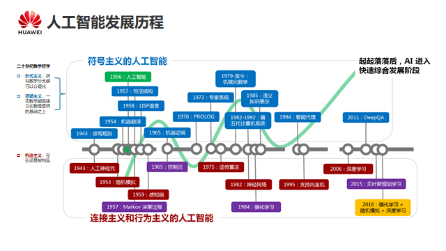
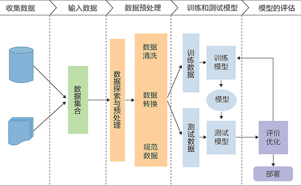

# 人工智能的起源

`Artificail Intelligence`

人工智能：正名于Dartmouth会议（1956年）


亚里士多德的三段论

数理逻辑

人工神经元模型

图灵的智能计算


学习或者智能的任何特性都能够被精确地加以描述，使得机器可以对其进行模拟。



# 人工智能学派

符号主义（逻辑主义）

连接主义（仿生学派）

行为主义（决策控制）


`Marvin Minsky`，神经网络和连接主义的奠基人。

`John McCarthy`，人工智能、Lisp的开创者、机器证明

`Allen Newell`，通用问题求解

`Herbert Simon`，通用问题求解

`Edward A. Feigenbaum`，专家系统之父

`Dabbala R. Reddy`，语音识别

`Leslie G. Valiant`，机器学习理论（PAC Learning）

`Judea Pearl`，贝叶斯网络，因果推断


# 大模型的发展

2017年，`Transformer`

2018年，`BERT`

2020年，`GPT-3`

2022年，`ChatGPT`

2024年，`Sora`


星火讯飞大模型

智谱清言

文心一言

Copilot（单点辅助）

代理agent（场景决策）


## AI Agent

https://www.bilibili.com/video/BV1RC4y1A7ZU/?spm_id_from=333.337.search-card.all.click


# 机器学习

`Machine Learning`

四要素：算法、算力、数据、场景

深度学习（`Deep Learning`）只是机器学习很小的一部分。


## 什么是机器学习？

`定义：假设用P来评估计算机程序在某任务T上的性能，若一个程序通过利用经验E在T中任务上获得了性能改善，则我们就说关于T和P，该程序对于E进行了学习。（Tom Mitchell）`

`机器学习 ≈ 需要一个函数，将输入映射到输出`

语言识别：`f(一段语音) = "文字"`

图像识别：`f(图像) = "识别结果"`

下象棋：`f(棋盘) = "下一步"`

对话系统：`f(对话) = "回答"`


## 机器学习算法的一般流程

**机器学习的目标：从假设空间中，即从输入空间到输出空间的模型映射空间中，寻找一个最优模型。**




```shell
数据收集 —> 原始数据 -> 数据处理 <-> 可用数据 -> 模型训练 -> 精度测试
											  ↑			 ↓
										    调整参数 <- 是否满足要求
										    			 ↓
										    		   模型部署
```

## 机器学习算法的分类

### 有监督学习

### 无监督学习

### 强化学习


线性回归和决策树

K均值聚类


# 深度学习

定义：深度学习时一种主要使用深度神经网络作为工具的机器学习算法。

深度学习源于人工神经网络的研究。深度学习通过组合低层特征形成更加抽象的高层来表示属性类别或者特征，以发现数据的分布式特征表示。

深度神经网络广泛应用于计算机视觉、自然语言处理等领域。


以下三种深度神经网络

全连接神经网络

卷积神经网络

循环神经网络


https://playground.tensorflow.org/


## 主流深度学习框架

`TensorFlow`

`PyTorch`

`MXNet`

`Paddle`

`Caffe`

`Theano`

`CNTK`

`Open-AI`

`Deeplearning4j`

`DSSTNE`


# 人工智能算法

早期探索（50-60）

> 建立模拟人类逻辑思维的计算模型

知识工程与专家系统（70-80）

> 有效表示和利用知识（专家系统）

机器学习（90-00）

> 从大量数据中自动学习模式，降低对人工规则的依赖，提供模型的泛化能力

深度学习（00-10）

> 多层神经网络，非线性特征

强化学习（10-至今）

> 不确定环境中的长期最优决策

自然语言处理的革新

> 特征提取的优化预训练


# AI算力平台

 华为-昇腾

昇腾处理器

NV处理器


# NLP

NLP模型核心功能就是提取语言特征。

AI算力关键是矩阵乘和向量计算。

OpenAI成功的关键因素：算力+数据+工程化能力。


# 参考

https://zhuanlan.zhihu.com/p/362647743?utm_id=0

