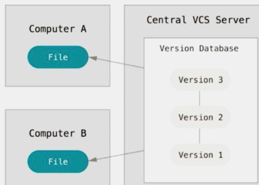
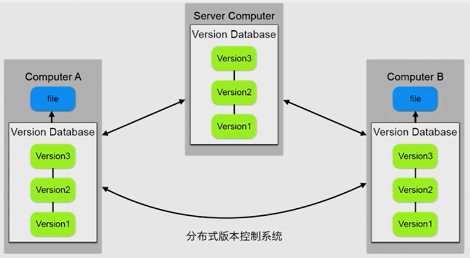
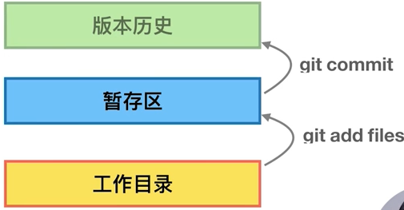

# 前言

## 版本管理的演变

### VCS（version control system）出现前

1、用目录贝区别不同版本
2、公共文件容易被覆盖
3、成员沟通成本很高，代码集成效率低下

### 集中式VCS

1、有集中的版本管理服务器
2、具备文件版本管理和分支管理能力
3、集成效率有明显地提高
4、客户端必须时刻和服务器相连

比如：

SVN



### 分布式VCS

1、服务端和客户端都有完整的版本库

2、脱离服务端，客户端照样可以管理版本

3、查看历史和版本比较等多数操作，都不需要访问服务器，比集中式VCS更能提高版本管理效率



# git

## 特点

1、最优的存储能力

2、非凡的性能

3、开源的

4、很容易做备份

5、支持离线操作

6、很容易定制工作流程


基于git的产品：

GitHub（提供devops能力，发布部署，CI等）

GitLab（开源，可定制CI）


## 安装

https://git-scm.com/downloads


## 配置

配置`user.name` 和`user.email`

```shell
git config --global user.name "your_name"
git config --global user.email "your_email@domain.com"
```


config的三个作用域

缺省等同于`local`

```shell
# loca只对某个仓库有效
git config --local
# global对当前用户所有仓库有效
git config --global    
# system对系统所有登录的用户有效
git config --system
```

显示config的配置，加`--list`
```shell
git config --list --local
git config --list --global
git config --list --system

git config --local user.name
```

        建Git仓库
初始化仓库

两种场景：
```shell
# 1.把已有的项目代码纳入Git管理
cd 项目代码所在的文件夹
git init

# 2.新建的项目直接用Git管理
cd 某个文件夹
git init your_project  # 会在当前路径下创建和项目名称同名的文件夹
cd your_project
```




添加文件到暂存区

```shell
git add 文件1 文件2 目录1 目录2
git add .
git add -u  # 当前所有未跟踪的文件都加入到暂存区
```


提交文件

```shell
git commit -m "xxx"
git commit -m"xxx"

# 2个操作合并
git commit -am "xxxx" # add + commit
```

重命名文件

```shell
mv 1.txt 2.txt
git rm 1.txt
git add 2.txt
git status

# 把暂存区的所有工作回退
git reset --hard
git mv 1.txt 2.txt
git status
```

## 查看log

```shell
# 默认查看当前分支
git log
git log --oneline
git log -n1
git log -n4
git log -n4 --oneline
git log -n4 --oneline --all
git log -n4 --oneline --graph

# 查看所有分支
git log --all

# 查看具体分支
git log dev1
git log --oneline dev1
git log -n1 dev1

# 图形化方式
git log --all --graph
```

## 分支

```shell
git branch
git branch -a
git branch -vv
git branch -av

# 根据commit点创建分支
git checkout -b dev1 41c534sd2
git checkout -b dev1 tag1
git checkout -b dev1 master

# 切换分支
git checkout master
```

查看帮助

```shell
git help --web log
```

图形界面工具

`gitk`

## .git目录

```shell
# .git/HEAD文件
cat .git/HEAD
ref: refs/heads/dev1

git checkout master
cat .git/HEAD
ref: refs/heads/master

# .git/config文件
配置文件
cat .git/config

# .git/refs目录
cd .git/refs
heads  tags
存放分支  存放标签（里程碑）
cd .git/refs/heads
master dev1
cat master
41a3d33s3s

cd .git/refs/tags
tag1 tag2
cat tag1
54sf21s2

# 查看对象类型
git cat-file -t 41a3d33s3s
commit
git cat-file -t 54sf21s2
tag

# 查看对象内容
git cat-file -p 41a3d33s3s
git cat-file -p 54sf21s2

# .git/objects目录
ae b2 73 4a pack(打包目录)
cd ae
73ksffs92312kds8123k1214k2983
# 查看类型
git cat-file -t ae73ksffs92312kds8123k1214k2983
tree
git cat-file -p ae73ksffs92312kds8123k1214k2983
blob 4f0ksd923s09ffsd3sdf 1.txt
git cat-file -t 4f0ksd923s09ffsd3sdf
blob
git cat-file -p 4f0ksd923s09ffsd3sdf
1.txt的内容
```

## git对象的关系

commit

tree

blob


一个`commit`对象里面会包含有 `tree`（相当于文件夹）、`parent`、`author`和`committer`。

一个`tree`里面会包含`tree`和`blob`（具体的内容）。

一个`blob`指的就是具体的文件内容。在git中，`blob`与文件名无关，只与文件内容有关，即文件内容相同，在git中是同一个`blob`。


Git 对象 是 Git 的最小组成单位，git 的所有核心底层命令实际上都是在操作 git 对象。

`git add` 命令，就是把文件快照存储成 `blob` 对象。

`git commit` 命令，就是把提交的文件列表和提交信息分别存储成 `tree` 对象和 `commit` 对象。

`git checkout -b`创建分支命令，就是创建一个指针指向 `commit` 对象。


参考：

https://blog.csdn.net/yao_94/article/details/88648468

https://xiaowenxia.github.io/git-inside/2020/12/06/git-internal.objects/index.html


## 分离头指针

`detached HEAD`

可以继续提交commit，但是当切换到分支进行开发时，如果没有把当前commit绑定tag或者分支，git就可能会清理掉这个commit。

```shell
git checkout commitidxxx
做了修改
git commit -am "xxx"

git checkout master
提示：
git checkout dev2 commitxxxx
```

## git差异

```shell
git diff commit1 commit2
git diff HEAD HEAD^
git diff HEAD HEAD~1

git diff HEAD HEAD^^
git diff HEAD HEAD~2
```

