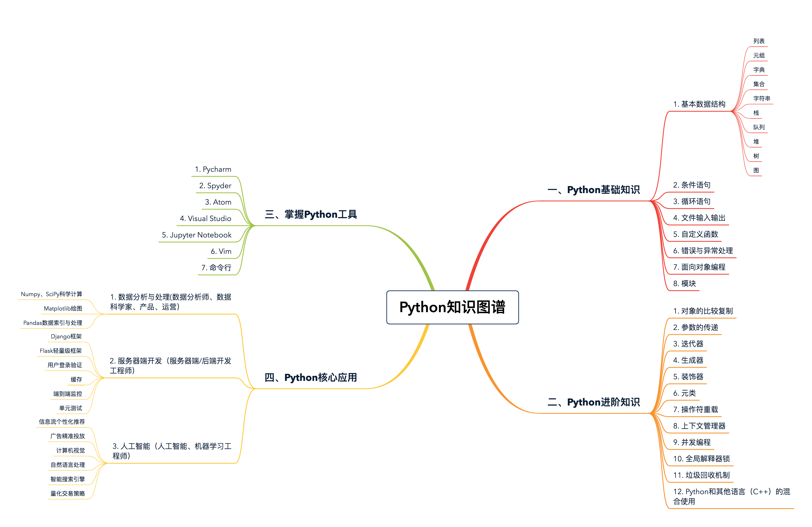

# 前言

目标：全栈工程师


应用领域：

1、机器学习

2、人工智能

3、数据分析

4、Web 开发

5、量化交易系统

6、爬虫


**从工程的角度去学习 Python**


学习感悟：

1、从工程的角度思考学习，以实用为出发点，多练习、多阅读、多做项目，这样才能有质的提高

2、基础不牢，地动山摇。更深刻、实质的基础理解，才是更牢固的知识大厦的根基。

3、没上过战场开过枪的人，不可能做主官；没有实战经验的语言学习者，不可能成为高手。

4、真正要掌握一门编程语言，仅仅学会分散的知识点是不够的，还必须要把知识点串联起来，做一些中型的项目才能有更深的领悟与提高。

5、融会贯通


编程语言的学习重点，总结成了下面这三步：

1、大厦之基，勤加练习

2、代码规范，必不可少

3、开发经验，质的突破





# Jupyter Notebook

https://jupyter.org/

Jupyter本地的两种安装办法：
1、安装Anconda。Anconda包含科学计算的几乎所有包，包含jupyter。
2、仅安装了Python。可以`pip install ipython, jupyter`
命令行启动`jupyter：jupyter notebook`


# 数据结构

## 列表和元组


### 列表和元组基础

都是一个可以放置任意数据类型的有序集合。

```python
l = [1, 2, 'hello', 'world'] # 列表中同时含有 int 和 string 类型的元素
l
[1, 2, 'hello', 'world']

tup = ('jason', 22) # 元组中同时含有 int 和 string 类型的元素
tup
('jason', 22)
```

列表是动态的，长度大小不固定，可以随意地增加、删减或者改变元素（mutable）。
而元组是静态的，长度大小固定，无法增加删减或者改变（immutable）。

```python
l = [1, 2, 3, 4]
l[3] = 40 # 和很多语言类似，python 中索引同样从 0 开始，l[3] 表示访问列表的第四个元素
l
[1, 2, 3, 40]

tup = (1, 2, 3, 4)
tup[3] = 40
Traceback (most recent call last):
File "<stdin>", line 1, in <module>
TypeError: 'tuple' object does not support item assignment
```

元组和列表的修改

```python
tup = (1, 2, 3, 4)
new_tup = tup + (5, ) # 创建新的元组 new_tup，并依次填充原元组的值
new _tup
(1, 2, 3, 4, 5)

l = [1, 2, 3, 4]
l.append(5) # 添加元素 5 到原列表的末尾
l
[1, 2, 3, 4, 5]
```

和其他语言不同，Python 中的列表和元组都支持负数索引，-1 表示最后一个元素，-2 表示倒数第二个元素，以此类推。

```python
l = [1, 2, 3, 4]
l[-1]
4

tup = (1, 2, 3, 4)
tup[-1]
4
```

列表和元组都支持切片操作

```python
l = [1, 2, 3, 4]
l[1:3] # 返回列表中索引从 1 到 2 的子列表
[2, 3]

tup = (1, 2, 3, 4)
tup[1:3] # 返回元组中索引从 1 到 2 的子元组
(2, 3)
```

列表和元组都可以随意嵌套

```python
l = [[1, 2, 3], [4, 5]] # 列表的每一个元素也是一个列表
tup = ((1, 2, 3), (4, 5, 6)) # 元组的每一个元素也是一元组
```

两者也可以通过 list() 和 tuple() 函数相互转换

```python
list((1, 2, 3))
[1, 2, 3]

tuple([1, 2, 3])
(1, 2, 3)
```

列表和元组常用的内置函数

`count(item) `表示统计列表 / 元组中 item 出现的次数。
`index(item)` 表示返回列表 / 元组中 item 第一次出现的索引。
`list.reverse()` 和 `list.sort()` 分别表示原地倒转列表和排序（注意，元组没有内置的这两个函数)。
`reversed()` 和 `sorted()` 同样表示对列表 / 元组进行倒转和排序，但是会返回一个倒转后或者排好序的新的列表 / 元组。

```python
l = [3, 2, 3, 7, 8, 1]
l.count(3)
2

l.index(7)
3

l.reverse()
l
[1, 8, 7, 3, 2, 3]

l.sort()
l
[1, 2, 3, 3, 7, 8]

tup = (3, 2, 3, 7, 8, 1)
tup.count(3)
2

tup.index(7)
3

list(reversed(tup))
[1, 8, 7, 3, 2, 3]
sorted(tup)
[1, 2, 3, 3, 7, 8]
```

### 列表和元组存储方式的差异

```python
l = [1, 2, 3]
l.__sizeof__()
64

tup = (1, 2, 3)
tup.__sizeof__()
48
```

可以看到，对列表和元组，我们放置了相同的元素，但是元组的存储空间，却比列表要少16 字节。

事实上，由于列表是动态的，所以它需要存储指针，来指向对应的元素（上述例子中，对于int 型，8 字节）。

另外，由于列表可变，所以需要额外存储已经分配的长度大小（8 字节），这样才可以实时追踪列表空间的使用情况，当空间不足时，及时分配额外空间。

```python
l = []
l.__sizeof__() // 空列表的存储空间为 40 字节
40

l.append(1)
l.__sizeof__()
72 // 加入了元素 1 之后，列表为其分配了可以存储 4 个元素的空间 (72 - 40)/8 = 4

l.append(2)
l.__sizeof__()
72 // 由于之前分配了空间，所以加入元素 2，列表空间不变
l.append(3)
l.__sizeof__()
72 // 同上
l.append(4)
l.__sizeof__()
72 // 同上
l.append(5)
l.__sizeof__()
104 // 加入元素 5 之后，列表的空间不足，所以又额外分配了可以存储 4 个元素的空间
```

上面的例子，大概描述了列表空间分配的过程。

可以看到，为了减小每次增加 / 删减操作时空间分配的开销，Python 每次分配空间时都会额外多分配一些，这样的机制（over-allocating）保证了其操作的高效性：增加 / 删除的时间复杂度均为 O(1)。

但是对于元组，情况就不同了。元组长度大小固定，元素不可变，所以存储空间固定。


### 列表和元组的性能
对比列表和元组存储方式的差异，可以得出结论：元组要比列表更加轻量级一些，所以总体上来说，元组的性能速度要略优于列表。

另外，Python 会在后台，对静态数据做一些资源缓存（resource caching）。

通常来说，因为垃圾回收机制的存在，如果一些变量不被使用了，Python 就会回收它们所占用的内存，返还给操作系统，以便其他变量或其他应用使用。
但是对于一些静态变量，比如元组，如果它不被使用并且占用空间不大时，Python 会暂时缓存这部分内存。这样，下次我们再创建同样大小的元组时，Python 就可以不用再向操作系统发出请求，去寻找内存，而是可以直接分配之前缓存的内存空间，这样就能大大加快程序的运行速度。


下面的例子，是计算初始化一个相同元素的列表和元组分别所需的时间。可以看到，元组的初始化速度，要比列表快 5 倍。

```python
python3 -m timeit 'x=(1,2,3,4,5,6)'
20000000 loops, best of 5: 9.97 nsec per loop

python3 -m timeit 'x=[1,2,3,4,5,6]'
5000000 loops, best of 5: 50.1 nsec per loop
```

但如果是索引操作的话，两者的速度差别非常小，几乎可以忽略不计

```python
python3 -m timeit -s 'x=[1,2,3,4,5,6]' 'y=x[3]'
10000000 loops, best of 5: 22.2 nsec per loop

python3 -m timeit -s 'x=(1,2,3,4,5,6)' 'y=x[3]'
10000000 loops, best of 5: 21.9 nsec per loop
```

当然，如果你想要增加、删减或者改变元素，那么列表显然更优。原因是对于元组，你必须得通过新建一个元组来完成。

### 列表和元组的使用场景

存储的数据和数量不变，用元组。

存储的数据或数量是可变的，用列表。

### 源码实现

list和tuple的内部实现都是array的形式，list因为可变，所以是一个over-allocate的array，tuple因为不可变，所以长度大小固定。

具体可以参照源码list:
https://github.com/python/cpython/blob/master/Objects/listobject.c

tuple:
https://github.com/python/cpython/blob/master/Objects/tupleobject.c


### 总结

列表和元组都是有序的，可以存储任意数据类型的集合。


区别主要在于下面这两点：
1、列表是动态的，长度可变，可以随意的增加、删减或改变元素。列表的存储空间略大于元组，性能略逊于元组。
2、元组是静态的，长度大小固定，不可以对元素进行增加、删减或者改变操作。元组相对于列表更加轻量级，性能稍优。


## list 列表

想创建一个空的列表，我们可以用下面的 A、B 两种方式，请问它们在效率上有什么区
别吗？我们应该优先考虑使用哪种呢？可以说说你的理由。

```python
# 创建空列表
# option A
empty_list = list()
# option B
empty_list = []
```

区别主要在于list()是一个function call，Python的function call会创建stack，并且进行一系列参数检查的操作，比较expensive，反观[]是一个内置的C函数，可以直接被调用，因此效率高。


本地测试（powershell）：

```python
PS C:\Users\xywan> python -m timeit 'empty_list = list()'
10000000 loops, best of 5: 37.6 nsec per loop
PS C:\Users\xywan> python -m timeit 'empty_list = []'
20000000 loops, best of 5: 15.9 nsec per loop

import timeit
print(timeit.timeit('list(x for x in range(1,1000))',number=10000))
print(timeit.timeit('[x for x in range(1,1000)]',number=10000))

import timeit
timeit.timeit('a=list()',number=10000)
timeit.timeit('a=[]',number=10000) 
timeit.timeit('a=()',number=10000) 
```

p.s:奇怪，为啥命令在cmd里不打印。。。


## tuple 元组


# 参考

《Python核心技术与实战》极客时间，作者：景霄


